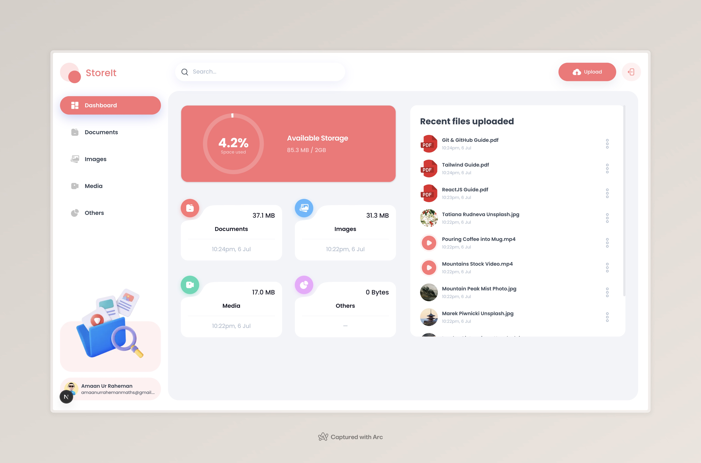
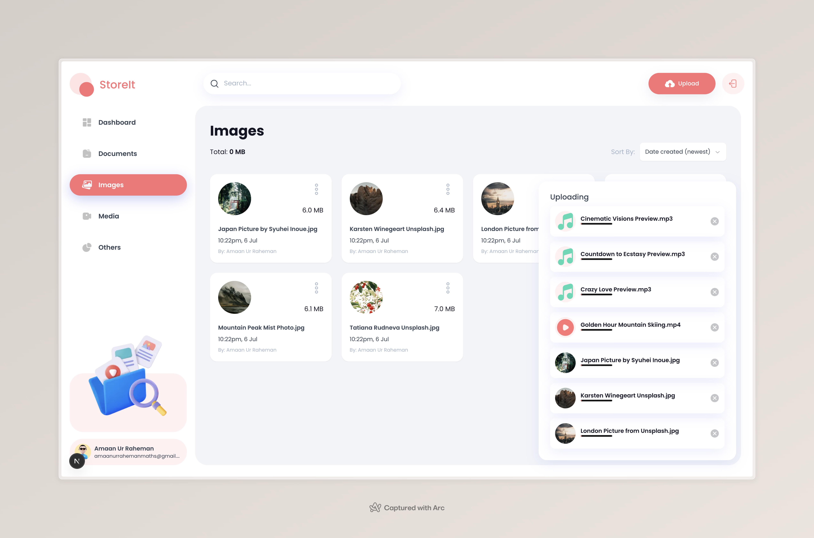
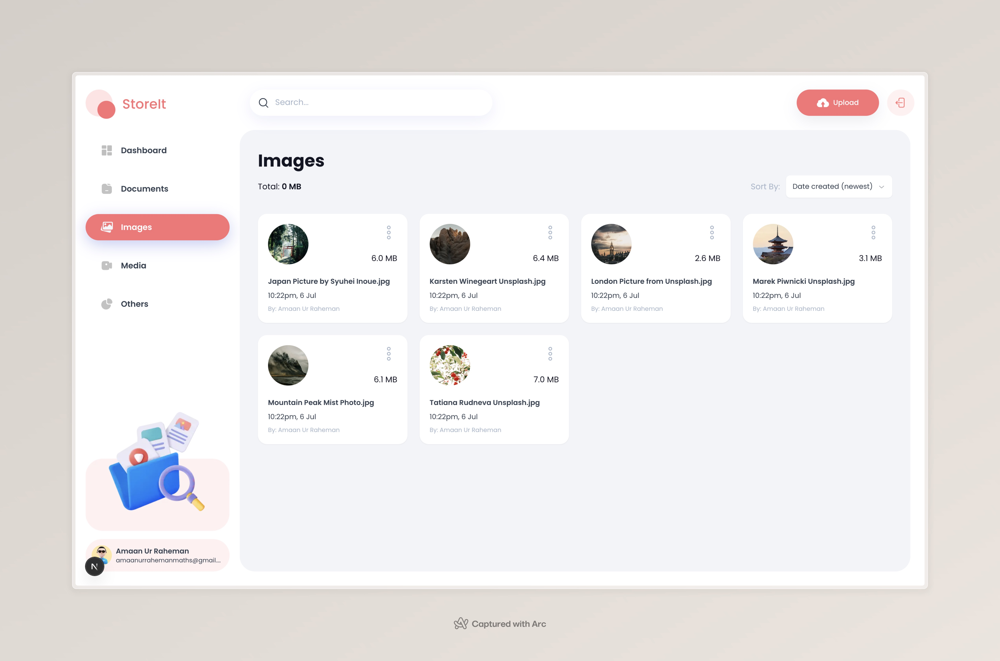
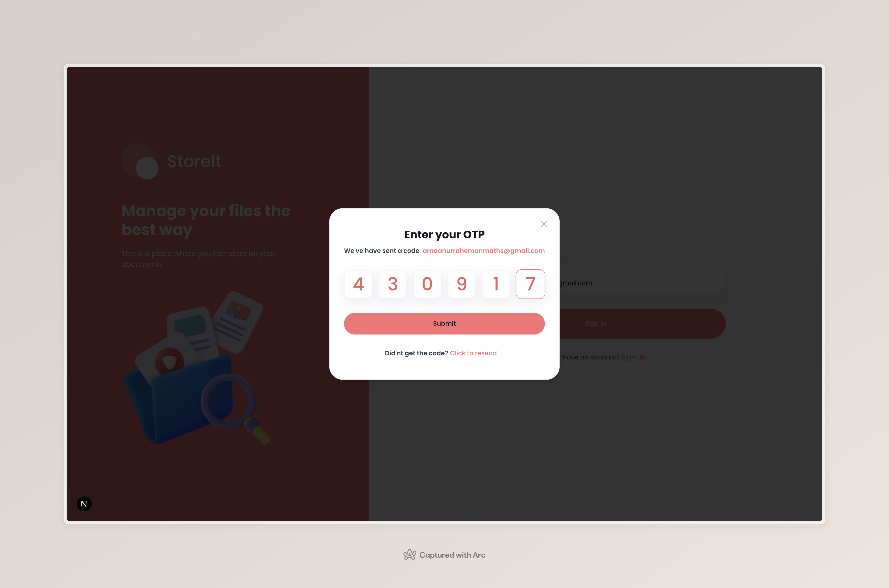

# 📁 StoreIt - Modern Cloud Storage Solution

<div align="center">
  


[](https://nextjs.org/)
[](https://www.typescriptlang.org/)
[](https://appwrite.io/)
[](https://tailwindcss.com/)
[](LICENSE)

**Your Personal Cloud Storage Platform - Secure, Fast, and Beautiful**

[🚀 Live Demo](https://storeit-storage-management-git-7a82b9-amaans-projects-f2c35ea9.vercel.app) • [🐛 Report Bug](https://github.com/amaan-ur-raheman/storeit-storage-management-solution/issues) • [💡 Request Feature](https://github.com/amaan-ur-raheman/storeit-storage-management-solution/issues)

</div>

---

## 🌟 Overview

StoreIt is a cutting-edge, full-stack cloud storage application that combines modern web technologies with an intuitive user experience. Built with **Next.js 15**, **TypeScript**, and **Appwrite**, it offers a secure and feature-rich platform for managing your digital files.

### ✨ Key Highlights

- 🔐 **OTP-Based Authentication** - Secure, passwordless login system
- 📊 **Visual Storage Analytics** - Beautiful charts showing storage usage
- 🔍 **Advanced Search & Filter** - Find files instantly with smart search
- 📱 **Fully Responsive** - Perfect experience on all devices
- 🎨 **Modern UI/UX** - Clean, intuitive interface built with Shadcn/UI
- 🚀 **High Performance** - Optimized with Next.js 15 and Turbopack
- 📤 **Drag & Drop Upload** - Effortless file uploading experience
- 👥 **File Sharing** - Share files securely with other users

---

## 🎯 Features

### 🔒 Authentication & Security
- **OTP Verification**: Secure email-based authentication
- **Session Management**: Persistent user sessions
- **File Permissions**: Owner-based file access control

### 📁 File Management
- **Multiple File Types**: Support for documents, images, videos, audio, and more
- **File Organization**: Categorize files by type (Documents, Images, Media, Others)
- **File Actions**: Rename, share, download, and delete operations
- **Storage Limits**: 2GB storage with visual usage tracking

### 🎨 User Experience
- **Dashboard Overview**: Quick access to recent files and storage stats
- **File Grid/List View**: Multiple viewing options for files
- **Real-time Search**: Instant search results with debounced queries
- **Responsive Design**: Seamless experience across desktop, tablet, and mobile
- **Dark Theme**: Modern dark interface design

### 📊 Analytics & Insights
- **Storage Usage Chart**: Visual representation using Recharts
- **File Type Breakdown**: See storage distribution by file types
- **Recent Activity**: Track recently uploaded files
- **Usage Statistics**: Monitor your storage consumption

---

## 🛠️ Tech Stack

<div align="center">

| Category | Technologies |
|----------|-------------|
| **Frontend** | Next.js 15, TypeScript, React 19 RC |
| **Styling** | Tailwind CSS, Shadcn/UI, Radix UI |
| **Backend** | Appwrite (Database, Storage, Auth) |
| **Form Handling** | React Hook Form, Zod Validation |
| **Charts** | Recharts |
| **State Management** | React Hooks, Server Actions |
| **File Handling** | React Dropzone, Native File API |
| **Deployment** | Vercel (recommended) |

</div>

---

## 🚀 Quick Start

### Prerequisites

- **Node.js** 18.0 or higher
- **npm** or **yarn**
- **Appwrite Cloud** account or self-hosted instance

### Installation

1. **Clone the repository**
   ```bash
   git clone https://github.com/amaan-ur-raheman/storeit-storage-management-solution.git
   cd storeit-storage-management-solution
   ```

2. **Install dependencies**
   ```bash
   npm install
   # or
   yarn install
   ```

3. **Environment Setup**
   
   Create a `.env.local` file in the root directory:
   ```env
   NEXT_PUBLIC_APPWRITE_ENDPOINT=https://cloud.appwrite.io/v1
   NEXT_PUBLIC_APPWRITE_PROJECT=your_project_id
   NEXT_PUBLIC_APPWRITE_DATABASE=your_database_id
   NEXT_PUBLIC_APPWRITE_USERS_COLLECTION=your_users_collection_id
   NEXT_PUBLIC_APPWRITE_FILES_COLLECTION=your_files_collection_id
   NEXT_PUBLIC_APPWRITE_BUCKET=your_storage_bucket_id
   NEXT_APPWRITE_KEY=your_api_key
   ```

4. **Start the development server**
   ```bash
   npm run dev
   # or
   yarn dev
   ```

5. **Open your browser**
   Navigate to [http://localhost:3000](http://localhost:3000)

### Appwrite Configuration

1. Create a new project in [Appwrite Console](https://cloud.appwrite.io)
2. Set up the following collections in your database:
   - **Users Collection**: Store user profiles
   - **Files Collection**: Store file metadata
3. Create a storage bucket for file uploads
4. Configure authentication settings
5. Update your environment variables with the generated IDs

---

## 📱 Screenshots

<details>
<summary>🖼️ View Application Screenshots</summary>

### Dashboard

*Main dashboard with storage analytics and recent files*

### File Upload

*Drag and drop file upload interface*

### File Management

*File grid view with actions dropdown*

### Authentication

*OTP-based login system*

</details>

---

## 🏗️ Project Structure

```
store-it/
├── app/
│   ├── (auth)/
│   │   ├── sign-in/
│   │   └── sign-up/
│   ├── (root)/
│   │   ├── [type]/
│   │   └── page.tsx
│   ├── globals.css
│   └── layout.tsx
├── components/
│   ├── ui/
│   ├── ActionDropdown.tsx
│   ├── AuthForm.tsx
│   ├── Chart.tsx
│   ├── FileUploader.tsx
│   ├── Search.tsx
│   └── ...
├── lib/
│   ├── actions/
│   ├── appwrite/
│   └── utils.ts
├── constants/
├── types/
└── public/
```

---

## 🔧 Configuration

### File Types Supported

- **Documents**: PDF, DOC, DOCX, TXT, XLS, XLSX, CSV, RTF, etc.
- **Images**: JPG, JPEG, PNG, GIF, BMP, SVG, WEBP
- **Videos**: MP4, AVI, MOV, MKV, WEBM
- **Audio**: MP3, WAV, OGG, FLAC
- **Others**: Any other file types

### Storage Limits

- **Maximum file size**: 50MB per file
- **Total storage**: 2GB per user
- **File formats**: All common formats supported

---

## 🤝 Contributing

We welcome contributions! Please see our [Contributing Guidelines](CONTRIBUTING.md) for details.

### Development Workflow

1. Fork the repository
2. Create a feature branch (`git checkout -b feature/AmazingFeature`)
3. Commit your changes (`git commit -m 'Add some AmazingFeature'`)
4. Push to the branch (`git push origin feature/AmazingFeature`)
5. Open a Pull Request

### Code Style

- Follow TypeScript best practices
- Use Prettier for code formatting
- Follow the existing component structure
- Write meaningful commit messages

---

## 📚 Documentation

### API Endpoints

The application uses Appwrite's REST API for backend operations:

- **Authentication**: `/v1/account`
- **Database**: `/v1/databases`
- **Storage**: `/v1/storage`

### Component Documentation

Key components and their purposes:

- `AuthForm`: Handles user authentication
- `FileUploader`: Manages file upload functionality
- `Chart`: Displays storage usage analytics
- `Search`: Provides real-time file search
- `ActionDropdown`: File action menu (rename, share, delete)

---

## 🐛 Troubleshooting

### Common Issues

1. **Environment Variables**: Ensure all Appwrite credentials are correctly set
2. **File Upload Errors**: Check file size limits and network connectivity
3. **Authentication Issues**: Verify Appwrite project configuration
4. **Build Errors**: Clear `.next` cache and reinstall dependencies

### Getting Help

- 🐛 Report bugs in [GitHub Issues](https://github.com/amaan-ur-raheman/storeit-storage-management-solution/issues)

---

## 📄 License

This project is licensed under the MIT License - see the [LICENSE](LICENSE) file for details.

---

## 🙏 Acknowledgments

- [Appwrite](https://appwrite.io/) for the powerful backend platform
- [Shadcn/UI](https://ui.shadcn.com/) for the beautiful UI components
- [Vercel](https://vercel.com/) for seamless deployment
- [Recharts](https://recharts.org/) for the analytics visualizations

---

<div align="center">

**Built with ❤️ by [Amaan Ur Raheman](https://github.com/amaan-ur-raheman)**

If you found this project helpful, please ⭐ star it on GitHub!

[🔝 Back to Top](#-storeit---modern-cloud-storage-solution)

</div>
